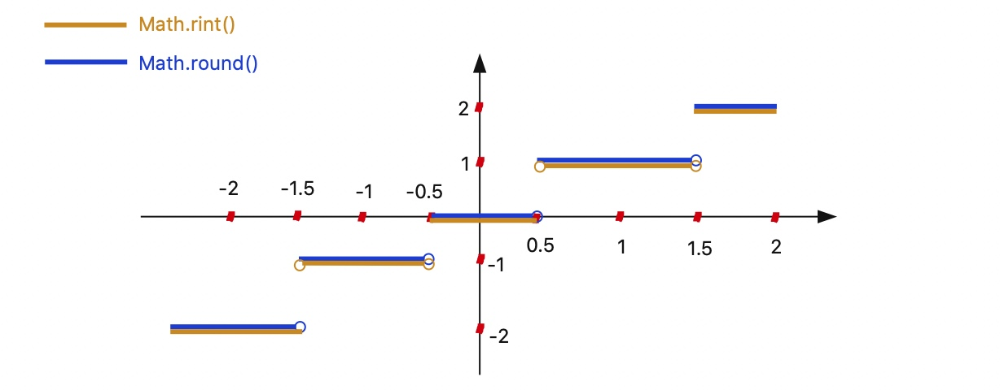

# Java数学函数的使用

Java的Math类中提供了一系列关于数学运算的静态方法，常见的运算整理如下[^ref]

## 算数运算

```java
Math.sqrt()     // 平方根
Math.cbrt()     // 立方根
Math.pow(a, b)  // 计算a的b次幂
Math.max(a, b)  // 计算最大值
Math.min(a, b)  // 计算最小值
Math.abs(a, b)  // 取绝对值
```

## 舍入运算

```java
Math.ceil()     // 向上取整
Math.floor()    // 向下取整
Math.round()    // 四舍五入, 返回int(参数为float时)或long(参数为double时)
Math.rint()     // 四舍五入, 返回double值(在 x.5 时向偶数舍入)
```

注意：除了中间值(.5)外，二者都是选择向靠近它的整数舍入。在不考虑返回值类型的情况下，二者的主要区别在于`Math.round`在.5时选择向大数舍入, 而`Math.rint()`会在.5的时候选择向靠近它的偶数舍入,例如1.5和2.5都向2舍入。

`Math.round` 和 `Math.rint`的区别:



## 随机数

Math自带一个随机数方法`Math.random()`, 用来生成一个`[0, 1)`范围内均匀分布的double类型(伪)随机数。也可以使用它通过算数运算来组合形成各个区间的随机数:
```java
Math.randon() * 2       // [0, 2)
Math.random() + 1       // [1, 2)
Math.random() * 3 + 3   // [3, 6)
...
```

java的工具类`java.util.Random`包中提供了更多关于随机数的方法

## 高级数学运算

```java
// 对数运算
Math.log()      // 自然对数(底数e)
Math.log10()    // 常用对数(底数10)
// 三角函数运算
Math.sin()
Math.cos()
Math.tan()
```


[^ref]: [部分参考内容链接](https://blog.csdn.net/xuexiangjys/article/details/79849888?utm_medium=distribute.pc_relevant.none-task-blog-BlogCommendFromMachineLearnPai2-1.nonecase&depth_1-utm_source=distribute.pc_relevant.none-task-blog-BlogCommendFromMachineLearnPai2-1.nonecase)