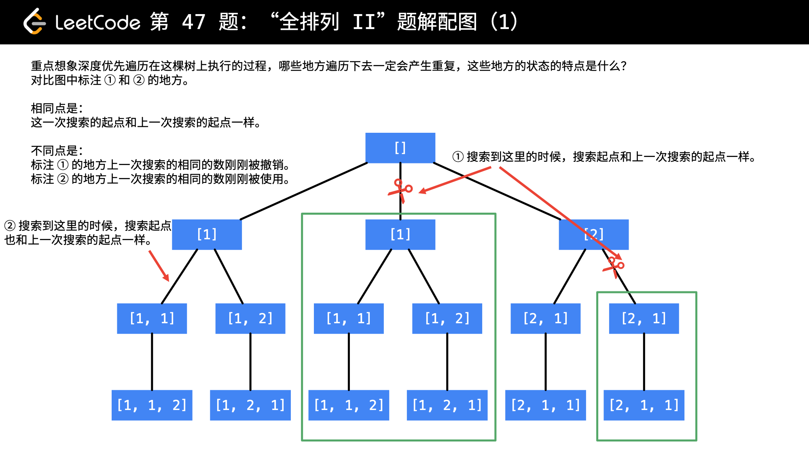

# 47. 全排列II（去重剪枝）

> 给定一个可包含重复数字的序列，返回所有不重复的全排列。

> 示例:

> ```
> 输入: [1,1,2]
> 输出:
> [
>   [1,1,2],
>   [1,2,1],
>   [2,1,1]
> ]
> ```
> 来源：力扣（LeetCode）
> 链接：https://leetcode-cn.com/problems/permutations-ii
> 
> 前置题目：[46. 全排列](mweblib://15928941637305)


## 回溯 + 剪枝

[leetcode题解参考连接](https://leetcode-cn.com/problems/permutations-ii/solution/hui-su-suan-fa-python-dai-ma-java-dai-ma-by-liwe-2/)

这道题在全排列的基础上增加了一个条件：元素可以重复。
但同时结果中不能出现重复的元组。

如果我们不考虑剪枝，单纯通过比较去重，就会造成非常大的时间开销。因此合理的做法是执行搜索前就先通过判断进行剪枝。判断的示意图如下：



如上图，对重复的元素展开搜索的时候就会出现重复结果。为了便于找重复的元素，我们可以把原数组进行排序，这样所有重复元素就会相邻了。

**剪枝的依据是：在搜索某个元素的过程中，原数组的上一个相同的元素被撤销了访问。**

这说明，之前已经完成过对该元素的搜索并返回了（因为是按照顺序访问的结点，所以不会先访问i再访问i-1），再对该元素展开搜索也会得到同样的结果，即重复结果。所以在这轮搜索中就直接跳过该元素。

```java
class Solution {
    public List<List<Integer>> permuteUnique(int[] nums) {
        List<List<Integer>> res = new ArrayList<>();
        if (nums.length == 0) {
            return res;
        }
        Arrays.sort(nums);
        boolean[] visited = new boolean[nums.length];
        dfs(nums, nums.length, 0, visited, new ArrayList<>(), res);

        return res;
    }

    private void dfs(int[] nums,
                     int len,
                     int depth,
                     boolean[] visited,
                     List<Integer> path,
                     List<List<Integer>> res) {
        if (depth == len) {
            res.add(new ArrayList<>(path));
            return;
        }
        for (int i = 0; i < len; i++) {
            if (!visited[i]) {
                // nums[i] == nums[i - 1]表示重复元素
                // !visited[i - 1] 表示上一个元素已经撤销访问
                if (i > 0 && nums[i] == nums[i - 1] && !visited[i - 1]) {
                    continue;
                }
                visited[i] = true;
                path.add(nums[i]);
                dfs(nums, len, depth + 1, visited, path, res);
                path.remove(path.size() - 1);
                visited[i] = false;
            }
        }
    }
}
```
