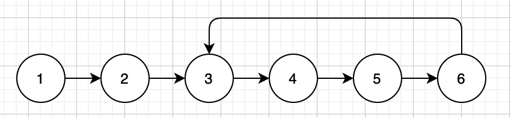
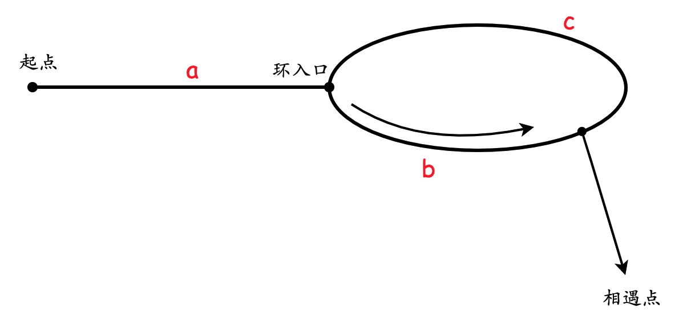

# 23. 链表中环的入口结点

> 如果一个链表中包含环，如何找出环的入口结点？例如，在下图所示的链表中，环的入口结点为3。
> 

## 解法1: 哈希表[^ref]

[^ref]: 解法参考牛客网回答 https://www.nowcoder.com/questionTerminal/253d2c59ec3e4bc68da16833f79a38e4?f=discussion

这种解法是最容易想的，实现也很简单。需要用一个哈希表存储访问过的结点，只需要一直找下一个结点并且放到哈希表中即可。如果发现了null，说明没有环；如果发现了哈希表中已经存在这个结点，说明它就是链表的入口结点。

```java
public class Solution {
    public ListNode EntryNodeOfLoop(ListNode pHead) {
        Set<ListNode> set = new HashSet<>();
        while (pHead != null) {
            if (set.contains(pHead)) {
                return pHead;
            }
            set.add(pHead);
            pHead = pHead.next;
        }
        return null;
    }
}
```

## 解法2：快慢指针

可以参考[面试题22-链表中倒数第k个结点](https://leetcode-cn.com/problems/lian-biao-zhong-dao-shu-di-kge-jie-dian-lcof/)的解法。

在上题中，使用一个指针先行k步，然后两个指针一起前进就能找到倒数第k个结点，对于本题来说，如果知道了环中结点的数量n，那么让快指针先行n步，两个指针再一起前进，就能在入口处相遇。

那么如何求出环中的结点个数呢？我们只要找到了任意一个在环中的结点，就可以进而统计环中结点的个数。关键就在于如何判断一个结点是否在环中了。

这里依然可以使用快慢指针的思想。从头结点开始，让快指针一次走两步，慢指针一次走一步。这样如果链表中存在环，这两个指针就一定会相遇，于是就可以找到环中的结点。
> 至于为什么一定会相遇，我刚开始有点没绕过来，直觉就在想会不会存在快指针没有和慢指针相遇而是直接跳到了慢指针前面的情况。
> 仔细一想就会发现快指针是不可能跳过慢指针的，因为快指针走2步，慢指针走1步，在环内的每次距离就会拉近1，肯定会慢慢地变成0，也就是相遇。速度差起码为2才能由-1跳过0直接变成+1。

找到环中的结点之后，只要绕环走一圈，就可以统计出环中结点的个数了，然后就可以利用前面的思路找到环的入口结点。

这个思路可以直接翻译成如下代码：
```java
public class Solution {
    public ListNode EntryNodeOfLoop(ListNode pHead) {
        if (pHead == null || pHead.next == null) {
            return null;
        }
        ListNode fast = pHead;
        ListNode slow = pHead;
        ListNode meeting = null;
        while (fast != null && fast.next != null) {
            slow = slow.next;
            fast = fast.next.next;
            if (slow == fast) { // 二结点相遇
                meeting = slow;
                break;
            }
        }
        if (meeting == null) {
            return null;
        }
        // 计算环中结点个数
        int count = 1;
        ListNode travel = meeting;
        while (travel.next != meeting) {
            count++;
            travel = travel.next;
        }
        // 找到入口结点
        fast = pHead;
        slow = pHead;
        for (int i = 0; i < count; i++) {
            fast = fast.next;
        }
        while (fast != slow) {
            fast = fast.next;
            slow = slow.next;
        }
        return slow;
    }
}
```

## 快慢指针: 更简洁的代码

**结论：使用快慢指针找到了环中的一个结点之后，只需要让两个指针分别从头结点和相遇结点出发，每次都走1步，就可以在入口处相遇。**

数学证明：


如图，我们假设：
起点到环入口的距离为`a`
环入口到相遇点距离为`b`
相遇点到环入口距离为`c`

那么相遇时:
快指针走过的距离为`a + b + k(b+c)`，其中k为整数，表示绕环k圈
慢指针走过的距离为`a + b`
而且快指针的距离为慢指针的两倍，所以：
$a + b + k\cdot (b+c)=2\cdot (a+b)$

化简可以得到:
$$a = c + (k - 1)(b + c)$$
其中,$k-1$是整数，$b+c$是环的长度，这一部分对指针的位置不产生影响。也就是说除去反复绕环的距离，就有$$a==c$$

因此上述结论成立。我们可以由此将代码简化，不必两个指针都从头进行，也不必计算环内结点的个数

```java
public class Solution {
    public ListNode EntryNodeOfLoop(ListNode pHead) {
        if (pHead == null || pHead.next == null) {
            return null;
        }
        ListNode fast = pHead;
        ListNode slow = pHead;
        while (fast != null && fast.next != null) {
            slow = slow.next;
            fast = fast.next.next;
            if (slow == fast) { // 二结点相遇
                slow = pHead;
                while (slow != fast) {
                    slow = slow.next;
                    fast = fast.next;
                }
                return slow;
            }
        }
        return null;
    }
}
```