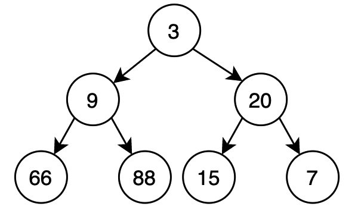
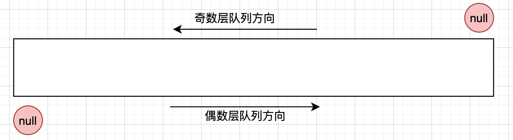
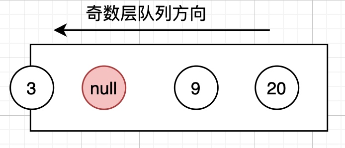
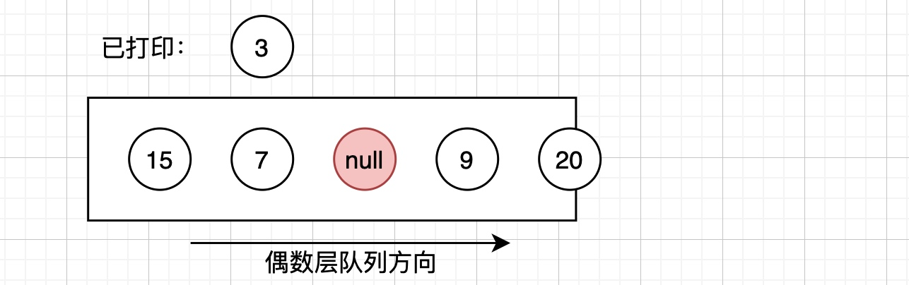
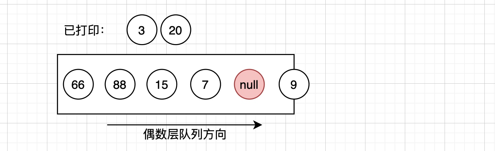
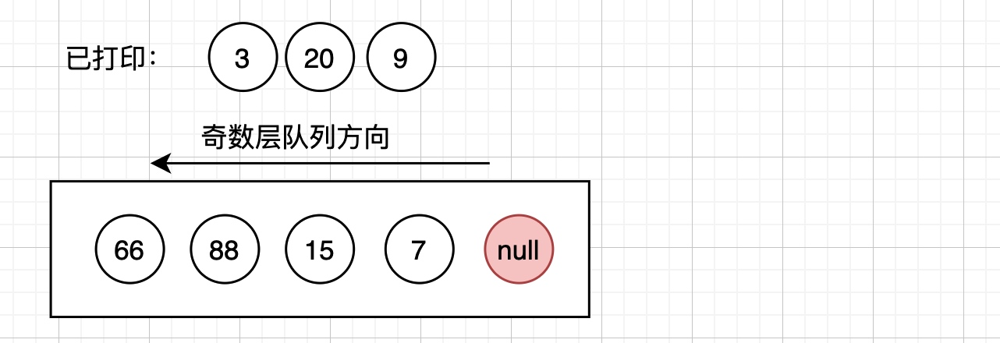

# 32-3 之字形打印二叉树

> 请实现一个函数按照之字形顺序打印二叉树，即第一行按照从左到右的顺序打印，第二层按照从右到左的顺序打印，第三行再按照从左到右的顺序打印，其他行以此类推。
> 例如:
> 给定二叉树: 
> 

> 返回其层次遍历结果：
> ```
> [
>   [3],
>   [20,9],
>   [66,88,15,7]
> ]
> ```
> 来源：力扣（LeetCode）
> 链接：https://leetcode-cn.com/problems/cong-shang-dao-xia-da-yin-er-cha-shu-iii-lcof

## 双端队列、奇偶层分别处理

如图，我们可以使用一个双端队列，奇数层和偶数层分别从不同的方向出队和入队。


当读取到null标记时说明这一层的结点已经全部读取完毕，这个时候只需要改变队列的方向，并且把null放回原处即可。

从队列中读取奇数层的结点的时候，把它们下一层的子结点按照**先左后右**的顺序入队，这样可以保证遇到null反转方向后，下一层偶数层的结点被按照另一个方向取出，

**第一层**：加入3，同时加入null。然后3出队并处理子结点9和20



下一步读取到null，把null放回原处，反转队列方向。

**第二层**：下一个出队的就是20，处理20，并且把子结点按照**先右后左**的顺序加入队列。并且直到读取到null后，都按照这样操作：
取出20:

取出9:

取到null，放回原处并改变队列方向


**第三层**：和第一层相同，由于这一层都没有子结点了，所以依次出队所有结点之后，队列为空，算法结束。


```java
class Solution {
    public List<List<Integer>> levelOrder(TreeNode root) {
        List<List<Integer>> ans = new ArrayList<>();
        if (root == null) {
            return ans;
        }
        Deque<TreeNode> deque = new LinkedList<>();
        List<Integer> list = new ArrayList<>();
        deque.addLast(root);
        deque.addLast(null);
        // rmFirst表示了出队的方向，默认从头部出队，这时应该从尾部入队
        boolean rmFirst = true;
        while (deque.size() != 0) {
            // 根据出队方向出队相应结点
            TreeNode node = rmFirst ? deque.removeFirst() : deque.removeLast();
            // 遇到了null标记
            if (node == null) {
                ans.add(list);
                if (deque.size() == 0) {
                    break;
                }
                list = new ArrayList<>();
                // 将null标记放回原处
                if (rmFirst) {
                    deque.addFirst(null);
                } else {
                    deque.addLast(null);
                }
                // 反转出队方向
                rmFirst = !rmFirst;
                continue;
            }
            list.add(node.val);
            if (rmFirst) {// 奇数层逻辑：先左后右，从尾部入队
                if (node.left != null) {
                    deque.addLast(node.left);
                }
                if (node.right != null) {
                    deque.addLast(node.right);
                }
            } else {    // 偶数层逻辑：先右后左，从头部入队
                if (node.right != null) {
                    deque.addFirst(node.right);
                }
                if (node.left != null) {
                    deque.addFirst(node.left);
                }
            }
        }
        
        return ans;
    }
}
```