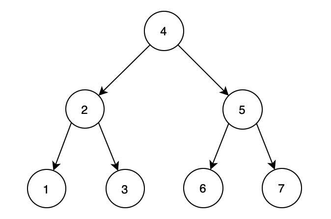
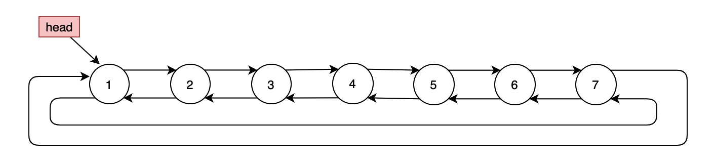

# 36. 二叉搜索树转双向链表

> 输入一棵二叉搜索树，将该二叉搜索树转换成一个排序的循环双向链表。要求**不能创建任何新的节点**，只能调整树中节点指针的指向。
> 
> 例如如下二叉搜索树：
> 
> 转换成循环双向链表后：
> 

## 中序遍历+保存头尾结点

首先需要利用二叉搜索树的性质：

**二叉搜索树的中序遍历结果是一个递增序列**

因此如果我们想要得到一个顺序的结果，可以使用中序遍历。中序遍历的基本模型如下：
```java
void inorder(TreeNode root) {
    if (root == null) {
        return;
    }
    inorder(root.left);
    visit(root);
    inorder(root.right);
}
```

因此我们可以在访问结点时，拿到结点的值，并且完成链表的构建。由于需要返回头结点，并且需要最终构建称为一个循环链表，所以我们可以使用两个全局变量用来保存结点：
`head`：保存头结点（即最小值结点）
`pre` ：保存前驱结点，用于构建链表

```java
class Solution {
    
    private Node pre = null;
    private Node head = null;
    
    public Node treeToDoublyList(Node root) {
        if (root == null) {
            return null;
        }
        inorder(root);
        // 对整棵树完成中序遍历后，pre结点就到达了最后一个结点
        head.left = pre;
        pre.right = head;
        return head;
    }
    
    private void inorder(Node root) {
        if (root == null) {
            return;
        }
        inorder(root.left);
        visit(root);
        inorder(root.right);
    }
    
    private void visit(Node cur) {
        if (pre != null) { 
            // 构建链表 pre -> cur
            pre.right = cur;
        } else { 
            // head为空，说明这是第一个被访问的结点，
            // 中序遍历第一个访问的结点一定是最小结点。
            head = cur;
        }
        // 构建链表 pre <- cur
        cur.left = pre;
        // 向后推进
        pre = cur;
    }
}
```

