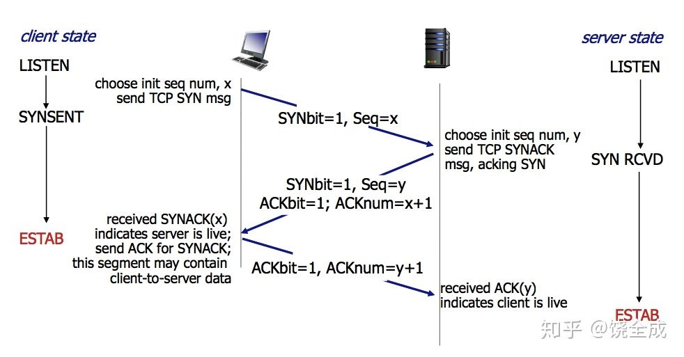
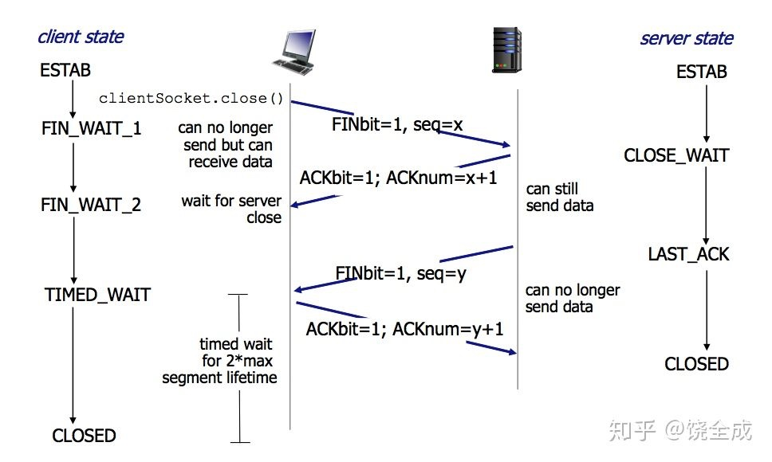

# TCP三次握手和四次挥手

TCP协议是面向连接的协议，在建立连接的时候需要经过三次握手；在关闭连接的时候需要四次挥手。

## 三次握手

图示[^pic1]：
[^pic1]: 图片来自知乎专栏: https://zhuanlan.zhihu.com/p/53374516

### 第一次握手：客户端->服务端 SYN

客户端向服务端发送一个特殊的TCP报文段，不包含应用层数据但SYN比特位被设置为1。因此这个报文段也称**SYN报文段**。
同时客户端会随机选择一个初始的序列号放在该报文段中，一并发送给服务端。

> 经过该阶段，服务器确认了客户端的发送正常、自己的接收正常。

### 第二次握手：服务端->客户端 SYNACK

服务器收到SYN报文段后，会为该TCP连接分配TCP缓存和变量，并向客户端发送允许连接的报文段。

该报文段被称为**SYNACK报文段**。不包含应用层数据，但有以下重要信息：
- SYN比特置1
- ACK比特置1
- TCP报文首部<u>确认字段</u>被设置为初始序列号+1
- 服务器选择的初始序列号

> 经过该阶段，客户端确认了自己的发送和接收正常、对方的发送和接收正常。

### 第三次握手：客户端->服务端 ACK

客户端收到SYNACK报文段后，客户端为该连接分配缓存和变量，同时向服务器发送另一个报文段。这个报文段对服务器的允许连接报文段进行了确认，它具有以下特点：
- SYN比特置0（因为双方连接已经建立）
- ACK比特置1
- 确认字段被设置为SYNACK报文的序列号+1（对SYNACK报文进行确认）
- 可以在报文段中携带应用层的数据

> 经过该阶段，服务器确认了客户端的接收正常、自己的发送正常。

### 问题

1. 为什么需要进行三次握手，而不是两次？

    三次握手的目的是建立可靠的通信信道，而由上述过程可以看出，经过三次握手，服务器和客户端都确认了双方的发送和接收正常。这三次握手缺一不可。

2. 为什么要传回SYN

    接收端传回发送端的SYN目的是为了告诉发送端我确认接收到的确实是你发送的报文段，而不是其他客户端发送的报文段。

## 四次挥手

TCP连接的建立通常都由客户端发起，而参与一条TCP连接的两个进程中的任意一方都能终止该连接。我们假设Client向Server发起了TCP连接终止的命令。

图示：

### 第一次挥手：Client -> Server FIN

Client发送一个特殊的报文段，将FIN置1，并指定了序列号。

此时Client进入`FIN_WAIT_1`状态，发送连接释放的报文段，并停止再发送数据，等待Server端的确认。

### 第二次挥手：Server -> Client ACK

Server发送ACK给Client，表示接受到了这个报文段，同时上层应用会得知对方发起了关闭连接操作，通常应用程序会对此作出自己的关闭操作。

此时，Server端处于`CLOSE_WAIT`阶段，即关闭等待。此时的TCP连接处于半关闭状态，客户端到Server端的连接释放。等到Client端接收到Server的ACK之后，进入`FIN_WAIT_2`状态。

### 第三次挥手：Server -> Client FIN

如果Server端也想断开连接了，那么Server像第一次挥手一样发送FIN给Client，并且指定一个序列号。

此时Server处于`LAST_ACK`状态，即最后确认状态，等待Client端的确认。

### 第四次挥手：Client -> Server ACK

Client发送ACK，确认收到了Server的FIN报文段

此时Client处于`TIME_WAIT`状态，等待一段时间之后才进入`CLOSE`状态，目的是确保Server端收到了自己的ACK。
Server端收到了ACK之后就进入了`CLOSE`状态。

#### 2MSL等待状态：

`TIME_WAIT`也称为2MSL等待状态。每个**具体TCP实现**必须选择一个报文段最大生存时间**MSL**（Maximum Segment Lifetime），它是任何报文被丢弃前再网络内的最长时间。这个时间是有限的，因为TCP报文以IP数据包在网络内传输，而IP数据报则有限制其生存时间的TTL字段。

对一个具体实现所给定的MSL值，处理的原则是：当TCP执行一个主动关闭，并发回最后一个ACK，该连接必须在TIME_WAIT状态停留的时间为2倍的MSL。这样可让TCP再次发送最后的ACK以防这个ACK丢失（另一端超时并重发最后的FIN）。

这种2MSL等待的另一个结果是这个TCP连接在2MSL等待期间，定义这个连接的Socket（客户的IP地址和端口号，服务器的IP地址和端口号）不能再被使用。这个连接只能在2MSL结束后才能再被使用

### 关闭连接过程中双方的状态序列：

### 问题[^ref]

[^ref]: 参考掘金「猿人谷」的文章：https://juejin.im/post/5d9c284b518825095879e7a5

1. 为什么需要挥手四次？

    和建立连接的三次挥手不同，建立连接时，一旦Server端收到了SYN报文之后，就可以立即回复SYNACK报文。
    而关闭连接的过程中，当Server端收到FIN报文的时候，很可能不会立刻关闭Socket，所以只能先回复一个ACK报文，告诉对方已经收到了FIN，而只有等Server端的所有报文都发送完了，才能发送FIN报文。

1. 四次挥手释放连接时，为什么要等待2MSL？

    1. 保证客户端发送的最后一个ACK报文段能够到达服务端。
    这个ACK报文段有可能丢失，使得处于LAST-ACK状态的B收不到对已发送的FIN+ACK报文段的确认，服务端超时重传FIN+ACK报文段，而客户端能在2MSL时间内收到这个重传的FIN+ACK报文段，接着客户端重传一次确认，重新启动2MSL计时器，最后客户端和服务端都进入到CLOSED状态，若客户端在TIME-WAIT状态不等待一段时间，而是发送完ACK报文段后立即释放连接，则无法收到服务端重传的FIN+ACK报文段，所以不会再发送一次确认报文段，则服务端无法正常进入到CLOSED状态。
    2. 防止“已失效的连接请求报文段”出现在本连接中。
    客户端在发送完最后一个ACK报文段后，再经过2MSL，就可以使本连接持续的时间内所产生的所有报文段都从网络中消失，使下一个新的连接中不会出现这种旧的连接请求报文段。
