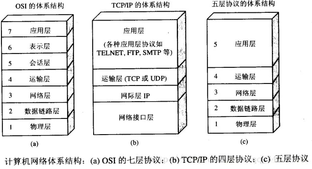
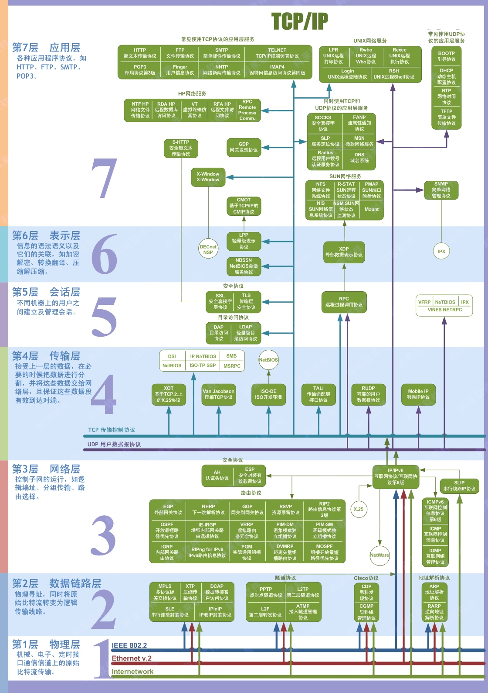

# 七层/五层协议的各层简单介绍

## 1. 应用层

应用层的任务是通过应用进程之间的交互来完成特定的网络应用。应用层协议定义的是应用进程之间的通信和交互的规则，对于不同的网络应用需要不同的应用层协议。

文件传输、电子邮件、文件服务、虚拟终端等
对应协议：HTTP、DNS、FTP、SMTP、Telnet等

### 表示层

数据格式化、代码转换、数据加密（没有协议）

### 会话层

解除或建立与别的节点的联系（没有协议）

## 2. 运输层

**传输层的主要任务是负责向两台主机进程之间的通信提供通用的数据传输服务。**
“通用的”是指它不针对某一个特定的网络应用，而是多种应用可以使用同一个运输层的服务。应用进程利用该服务传送应用层报文。

运输层的协议主要有两种：TCP和UDP

### TCP协议

- TCP是面向连接的。
- 每条TCP连接只能是一对一
- TCP提供可靠交付的服务，保证数据无差错、无丢失、无重复、按需到达
- TCP提供全双工通信，允许连接双方的应用进程在任何时候都能够发送数据。

### UDP协议

- 无连接
- 不保证可靠交付
- 面向报文
- 没有拥塞控制
- 支持一对一、一对多和多对多的交互通信
- 首部开销更小，只有8个字节，比TCP的20个字节的首部更短。

## 3. 网络层

**网络层负责为分组交换网络上的不同主机提供通信服务。**
在发送数据时，网络层把运输层产生的豹纹短或用户数据包封装成分组和包进行传送。由于**网络层使用IP协议**，因此网络层的分组也叫**IP数据报**。

> **注意：**区分“数据报”和“分组”的概念。任何一层的数据单元，都可以用“分组”来表示

网络层的另一个任务是**选择合适的路由，使源主机运输层所向下传递的分组能够通过网络层中的路由器找到目标主机。**

## 4. 数据链路层

两台主机之间的数据传输，总是在一段又一段两两相连的链路上传送的。数据链路层（简称链路层），**负责相邻两个节点之间的数据传输**。
在相邻两个节点之间传送数据时，数据链路层将网络层的IP数据报组装成**帧**，并在相邻的两个节点的链路上进行帧的传递。每一个帧包含了数据和必要的控制信息（同步信息、地址信息、差错控制等）。

在接收数据时，控制信息使接收端能够知道一个帧从哪个比特开始，到哪个比特结束，这样当数据链路层收到一个帧之后，就可以提取出其中的数据部分，从而向上交给网络层处理。还可以通过控制信息检测到帧中的差错。

## 5. 物理层

物理层上传输的数据单位是比特。物理层的作用是实现相邻计算机节点之间的比特流的**透明传送**，尽可能屏蔽具体的传输介质和物理设备之间的差异。让链路层不必考虑网络的具体传输介质是什么。

