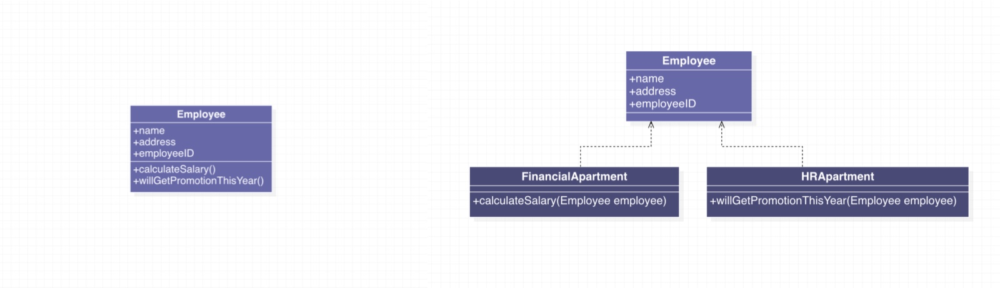

# 面向对象设计原则

在了解设计模式之前，我们必须知道面向对象设计的几大设计原则，各种设计模式都离不开这些设计原则的思想。
[toc]

## 原则一：开闭原则

> 一个软件实体（如类、模块、函数）应当对扩展开放，对修改关闭

这个原则要求我们在设计时注意：
- 用抽象构建框架，用实现扩展细节
- 不以改动原有类的方式实现新的需求，而应当以实现事先抽象出来的接口或继承抽象类的方式来实现。

**优点：**

可以在不改动原有代码的前提下给程序扩展功能，增加了程序的可扩展性，同时降低了维护成本。

例如：未遵循开闭原则（左）和遵循开闭原则（右）

## 原则二：单一职责原则

> 一个类只应该有一个职责，即只有一个导致该类变更的原因。

**定义解读：**

- 类职责的变化往往是导致类变化的原因：如果一个类具有多种职责，那么就会有多种原因可能导致该类发生变化，从而导致这个类的维护变得困难。
- 在软件开发中随着需求的不断增加，可能会给原来的类添加一些本来不属于它的一些职责，这就违反了单一职责原则。我们应当把不属于该类真正职责的部分分离出去。
- 不仅是类，函数/方法也应当遵循单一职责原则，即一个函数/方法只做一件事情。

**优点：**

将类与方法的职责划分清晰，不仅可以提高代码可读性，而且可以降低程序的维护成本。

例如，未遵循单一职责原则（左）和遵循单一职责原则（右）

## 原则三：依赖倒转原则

> - 依赖抽象，而不是依赖实现；
> - 抽象不应该依赖细节，细节应该依赖抽象；
> - 高层模块不能依赖低层模块：二者都应该依赖抽象。

**定义解读：**

1. 针对接口编程，而不是针对实现编程
2. 尽量不要从具体的类派生，而是以继承抽象类或实现接口来实现

**优点：**

通过抽象来搭建框架，建立类和类的关联，以减少类之间的耦合性。而且以抽象搭建的系统要比以具体实现搭建的系统更加稳定，扩展性更高，同时更便于维护

例如，未遵循依赖倒转原则（左）和遵循依赖倒转原则（右）：

## 原则四：接口隔离原则

> 多个特定的接口要优于一个通用的接口

**定义解读：**

1. 客户端不应该依赖它不需要实现的接口
2. 不应建立臃肿庞大的接口，尽量细化接口，接口中的方法应该尽可能少。

**优点：**

避免同一个接口里面包含不同类职责方法，接口责任划分更加明确，符合高内聚、低耦合的思想。

例如：未遵循接口隔离原则（左）和遵循接口隔离原则（右）：

## 原则五：迪米特法则

> 如果两个类不必彼此直接通信，那么这两个类就不应当发生直接的相互作用。如果其中的一个类需要调用另一个类的某一个方法的话，可以通过第三者转发这个调用。

**定义解读：**

一个类应该只和它的成员变量，方法的输入，返回参数中的类作交流，而不应该引入其他的类（间接交流）

**优点：**

实践迪米特法则可以良好地降低类与类之间的耦合，减少类与类之间的关联程度，让类与类之间的协作更加直接

例如：未遵循迪米特法则（左）和遵循迪米特法则（右）

## 原则六：里氏替换原则

> 所有引用基类的地方必须能透明地使用其子类的对象。

**定义解读：**

- 所有引用基类的地方必须能透明地使用其子类的对象，也就是说子类对象可以替换其父类对象，而程序执行效果不变。
- 在继承体系中，子类中可以增加自己特有的方法，也可以实现父类的抽象方法，但是不能重写父类的非抽象方法，否则该继承关系就不是一个正确的继承关系。

**优点：**

1. 子类拥有父类的所有方法和属性，从而可以减少创建类的工作量。
2. 提高了代码的重用性。
3. 提高了代码的扩展性，子类不但拥有了父类的所有功能，还可以添加自己的功能。

---
摘抄自掘金作者：J_Knight_
链接：https://juejin.im/post/5b9526c1e51d450e69731dc2